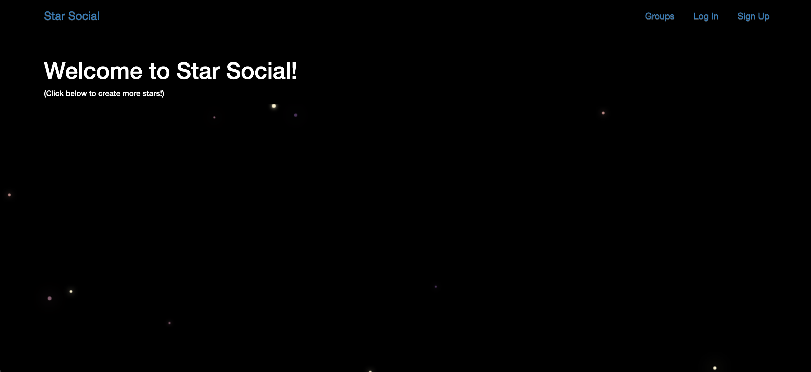

# Star Social



> A social media site that is intended for lovers of space exploration! It also features an interactive Canvas animation.

---

### Table of Contents

- [Star Social](#star-social)
    - [Table of Contents](#table-of-contents)
  - [Description](#description)
      - [Technologies](#technologies)
  - [How To Use](#how-to-use)
    - [Installation](#installation)
  - [References](#references)
  - [Author Info](#author-info)

---

## Description

This project is the second of two built while taking Jose Portilla's course "Python and Django Full Stack Web Developer Bootcamp" on Udemy. It is a blog-style social media application that has group, post, user signup/login capabilities, and a really fun HTML5 Canvas animation in the background. This site also uses Postgres as the database.

#### Technologies

- Django
- HTML5
- Javascript
- CSS3
- Bootstrap
- Postgres
- Docker

[Back To The Top](#star-social)

---

## How To Use

This project is currently deployed using Docker on a Heroku free-tier dyno.

It can be viewed live at [atummillo-star-social.herokuapp.com](https://atummillo-star-social.herokuapp.com/)
- (The site may take up to 15 seconds to load if the server has not been contacted in a while)

### Installation
- Make sure you have both Git and Docker installed on your machine.
```unix
    git clone https://github.com/ATummillo/star-social.git
    cd star-social
    docker-compose up
```
The site should now be live at [localhost:8000](http://localhost:8000)

[Back To The Top](#star-social)

---

## References

["Python and Django Full Stack Web Developer Bootcamp"](https://www.udemy.com/course/python-and-django-full-stack-web-developer-bootcamp/) by Jose Portilla

[Back To The Top](#star-social)

---

## Author Info

- Personal Website - [anthonytummillo.com](https://anthonytummillo.com)
- Codepen - [codepen.io/ATummillo](https://codepen.io/ATummillo/)
- LinkedIn - [linkedin.com/in/anthonytummillo](https://www.linkedin.com/in/anthonytummillo/)
- Email - atummillo.dev@gmail.com

[Back To The Top](#star-social)